# SmartHRM

SmartHRM is a human resource management system based on Spring Boot, designed to help enterprises efficiently manage employee, skill, project, and training information.

## Multi-Language Index
- [README.md](README.md) - Chinese
- README-en.md - Here

## Features Overview

- **Employee Management**: Supports CRUD operations for employees.
- **Skill Matching**: Intelligent matching of suitable employees based on project skill requirements.
- **Project Matching**: Fuzzy search project by name or involved employee's id.
- **Task Assignment**: Assign tasks to project members and track completion rates.
- **Department and Project Management**: Manage organizational structure and project information.
- **Training Management**: Manage employee training records.

## Technology Stack

- Spring Boot
- MongoDB
- Thymeleaf (frontend template engine)
- Bootstrap & jQuery (styling + data interaction & http requests)

## Module Description

### Core Modules

- **EmployeeController**: Manages employee information, including basic CRUD operations.
- **SkillMatchController**: Provides skill matching functionality, allowing search for suitable employees based on required project skills.
- **ProjectMatchController**: Manages project & task information, with basic CRUD operations for project addition, task assignment, and project progress tracking.
- **SkillController**: Manages skill information.
- **TrainingController**: Manages training information, including adding training sessions.
- **DepartmentController**: Manages departmental information, allowing for employee transfers.

### Data Access Layer

- **Dao**: Direct access to MongoDB operations and various queries (fuzzy, pagination).
- **Repo**: Entity class data access layer.
- **DTO**: Simple data transfer objects to reduce redundant data transmission, containing data transfer methods and special processing methods.

### Entity Classes

- **Employee**: Employee entity containing name, department, skill list, and other information.
- **Skill**: Skill entity containing skill name, type, and other information.
- **Project**: Project entity containing project name, member list, required skills, and other information.
- **Department**: Department entity containing department name, manager ID, employee list, and other information.
- **Task**: Tasks assigned to multiple employees within a project.
- **Training**: Training courses designated for multiple employees.

## Quick Start

### Prerequisites

- Java 17
- MongoDB
- Maven
- SpringBoot 3.x

### Configuration

1. Modify `application.yml` or use `application-dev.yml` / `application-prod.yml` to configure database connections and other settings.
2. Start the MongoDB service.

### Run the Project

Run the main class `SmartHrmApplication.java` or run the latest version `.jar` package.

```bash
java -jar xxx.jar
```

Access `localhost:8080/corresponding-route/` to use the system.

## Usage Instructions

- **Employee Management**: Visit `/employees/` route to perform add, modify, delete operations on employees.
- **Project Management**: Access `/departments/` route to add, modify, delete projects.
- **Skill Matching**: Access `/skillmatch/` route, select required skills, and the system will automatically match eligible employees.
- **Skill & Training Management**: Visit `/training/` route to manage skill & training information.
- **Project Matching Management**: Access `/projectmatch/` route to fuzzy search project details by project name or involved employee id.
- **Application.yml**: Set up local or cloud database URLs, see details in the active .yml file.

## Contribution Guidelines

Contributions and suggestions are welcome! Please follow these steps:

1. Fork this repository.
2. Create a new branch (`git checkout -b feature/new-feature`).
3. After fetching the latest update from the remote repository, add your changes to git version control.
4. Commit your changes with a description (`git commit -m 'Add new feature'`).
5. Push to the remote branch (`git push origin feature/new-feature`).
6. Submit a Pull Request.

## License

This project is licensed under the MIT License - see the [LICENSE](LICENSE) file for details.

## Demo Pages (style-Unconsistent ver.)

### **Employee Management**: `/employees/`

#### 	Total Interface

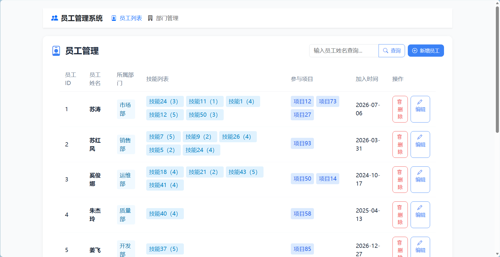

#### 	Edit Employee

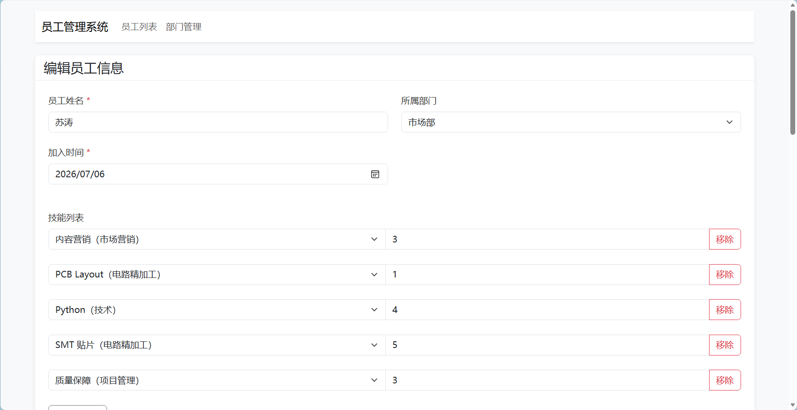

#### 	Add Employee


### **Department Management**: `/departments/`

#### 	Total Interface

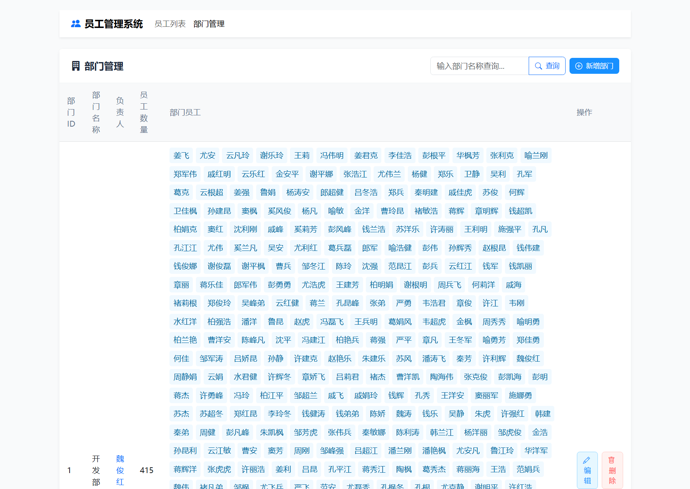

#### 	Edit Project

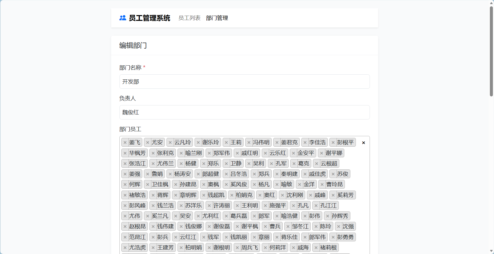

#### 	Add Department

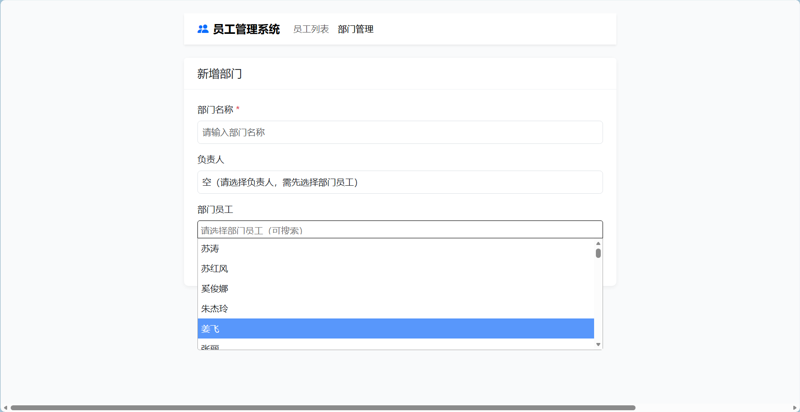

### **Skill Matching**: `/skillmatch/`

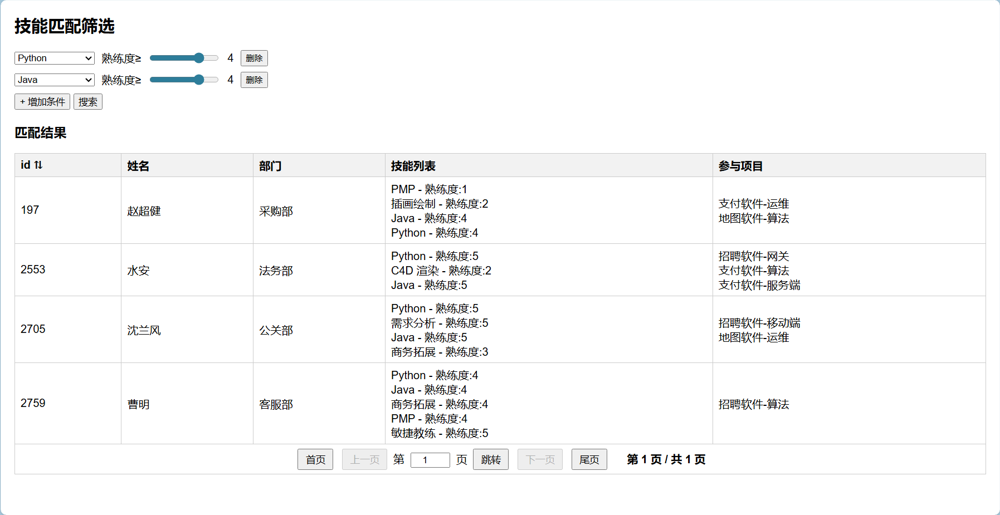

### **Project Management**: `/projectmatch/`

#### 	Total Interface

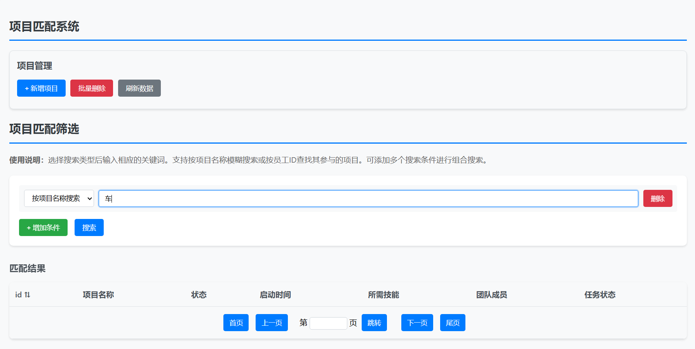

#### 	Edit Project

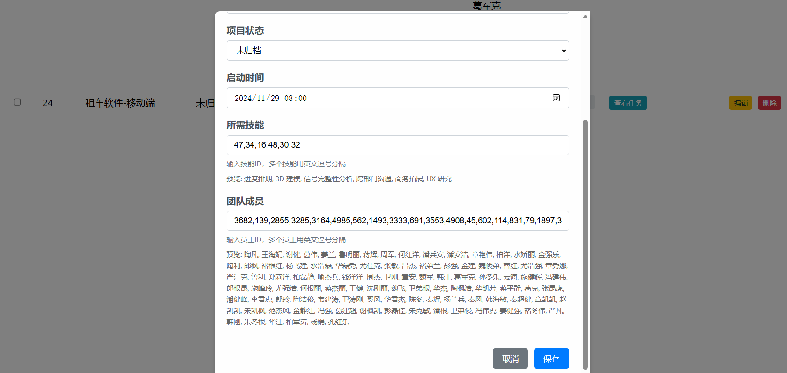

#### 	Assign Tasks

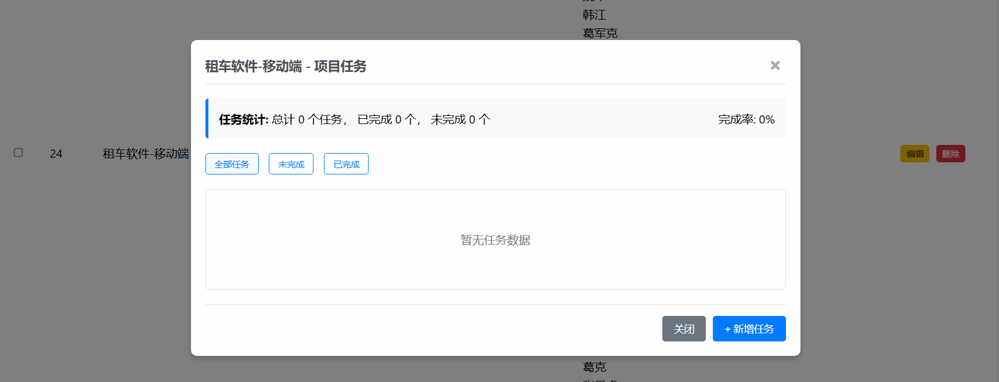

#### 	Start Project

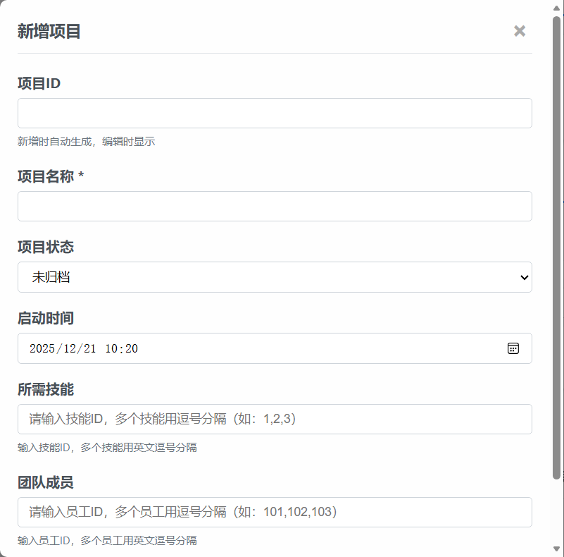

### 	**Skill & Training Management**: `/training/`

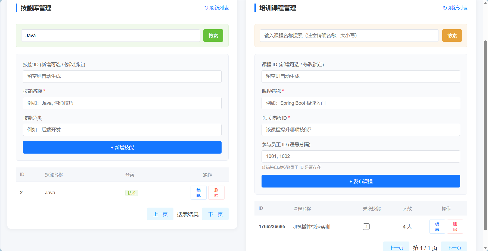
